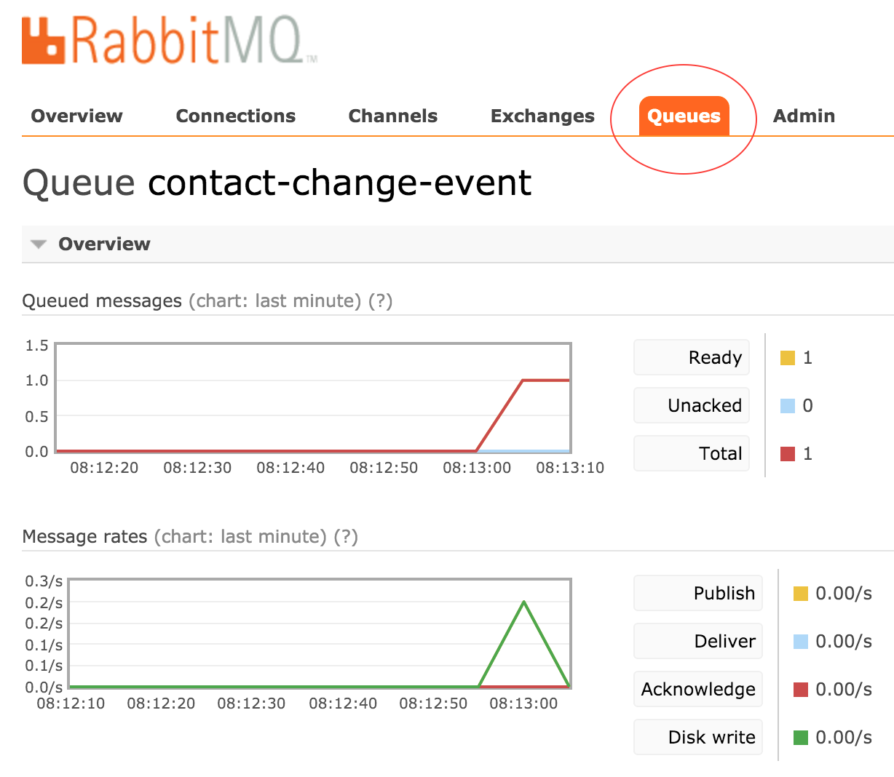
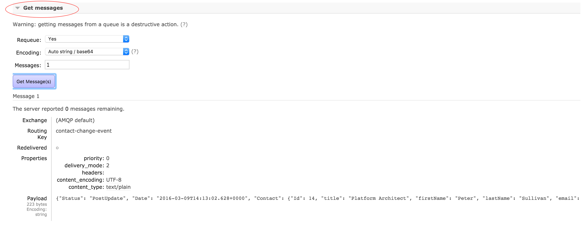

= Lab 1 - From Zero to Pushing Your First Application

== Background

This application is a backend RESTFul event-driven data microservice using Spring Boot, JPA, REST & AMQP. It also uses Swagger to provide interactive documentation and testing of the APIs. Using link:++http://projects.spring.io/spring-data-jpa/++[Spring Data JPA], it implementation of data access layers by reducing the effort to the amount that's actually needed. As a developer you write your repository interfaces, including custom finder methods, and Spring will provide the implementation automatically. By providing dependency to Spring Data REST, it will make the JPA repository RESTFul. In addtion, we have also implemented EntityListener, which would emmit any changes to the Entity/Domian Model and publish the change event onto messaging bus (RabbitMQ) using AMQP.

image::ContactDataService.png[]

To learn more about the Spring Boot Web App using Spring Data JPA, take a look at the link:++https://springframework.guru/spring-boot-web-application-part-3-spring-data-jpa++[tutorial].

== Target

. If you haven't download the workshop project, link:++https://github.com/jigsheth57/Cloud-Native-Workshop/archive/master.zip++[click here to download] or you can clone the git project using git client (git clone https://github.com/jigsheth57/Cloud-Native-Workshop).

. If you haven't already, download the latest release of the link:++https://github.com/cloudfoundry/cli/releases++[Cloud Foundry CLI] for your operating system and install it.

. Set the API target for the CLI: (**set appropriate end point for your environment**)
+
----
$ cf api https://api.local.pcfdev.io --skip-ssl-validation
----

. Login to Pivotal Cloudfoundry:
+
----
$ cf login
----
+
Follow the prompts (Note: login as "admin" and password as "admin" for local pcfdev deployment)

== Push It!

. Change to the _contactDataService_ sample application directory:
+
----
$ cd $WORKSHOP_HOME/lab1/contactDataService
----
. Create Service Instances for contactDataService (**set appropriate service and service plan for your environment**)
+
[source,bash]
----
Getting services from marketplace in org pcfdev-org / space pcfdev-space as admin...
OK

service      plans        description   
p-mysql      512mb, 1gb   MySQL databases on demand   
p-rabbitmq   standard     RabbitMQ is a robust and scalable high-performance multi-protocol messaging broker.   
p-redis      shared-vm    Redis service to provide a key-value store   

TIP:  Use 'cf marketplace -s SERVICE' to view descriptions of individual plans of a given service.

$ cf cs p-mysql 512mb p-mysql
$ cf cs p-rabbitmq standard p-rabbitmq
----
. Push the application!
+
----
$ cf push
----
+
You should see output similar to the following listing. Take a look at the listing callouts for a play-by-play of what's happening:
+
====
[source,bash]
----
Using manifest file /Users/jsheth/Documents/workspace/Spring-PCF-Workshop/lab1/contactDataService/manifest.yml  // <1>

Creating app contactDataService in org pcfdev-org / space pcfdev-space as admin...
OK // <2>

Creating route contactdataservice-nonvulcanized-brier.local.pcfdev.io...
OK // <3>

Binding contactdataservice-nonvulcanized-brier.local.pcfdev.io to contactDataService...
OK // <4>

Uploading contactDataService...   
Uploading app files from: /Users/jsheth/Documents/workspace/Spring-PCF-Workshop/lab1/contactDataService/target/contactDataService-0.0.1-SNAPSHOT.jar
Uploading 916.8K, 118 files // <5>
Done uploading               
OK
Binding service p-mysql to app contactDataService in org pcfdev-org / space pcfdev-space as admin...
OK // <6>
Binding service p-rabbitmq to app contactDataService in org pcfdev-org / space pcfdev-space as admin...
OK

Starting app contactDataService in org pcfdev-org / space pcfdev-space as admin...  // <7>
Downloading binary_buildpack...
Downloading python_buildpack...
Downloading staticfile_buildpack...
Downloading nodejs_buildpack...
Downloading php_buildpack...
Downloading go_buildpack...
Downloading java_buildpack...
Downloading ruby_buildpack...
Downloaded java_buildpack
Downloaded python_buildpack
Downloaded php_buildpack
Downloaded ruby_buildpack
Downloaded staticfile_buildpack
Downloaded binary_buildpack
Downloaded go_buildpack
Downloaded nodejs_buildpack
Creating container
Successfully created container
Downloading app package...
Downloaded app package (31.8M)
Staging...
-----> Java Buildpack Version: v3.6 (offline) | https://github.com/cloudfoundry/java-buildpack.git#5194155
-----> Downloading Open Jdk JRE 1.8.0_71 from https://download.run.pivotal.io/openjdk/trusty/x86_64/openjdk-1.8.0_71.tar.gz (found in cache) // <8>
       Expanding Open Jdk JRE to .java-buildpack/open_jdk_jre (0.9s)
-----> Downloading Open JDK Like Memory Calculator 2.0.1_RELEASE from https://download.run.pivotal.io/memory-calculator/trusty/x86_64/memory-calculator-2.0.1_RELEASE.tar.gz (found in cache)
       Memory Settings: -Xmx160M -XX:MaxMetaspaceSize=64M -Xss853K -Xms160M -XX:MetaspaceSize=64M
-----> Downloading Maria Db JDBC 1.3.4 from https://download.run.pivotal.io/mariadb-jdbc/mariadb-jdbc-1.3.4.jar (found in cache) // <9>
-----> Downloading Spring Auto Reconfiguration 1.10.0_RELEASE from https://download.run.pivotal.io/auto-reconfiguration/auto-reconfiguration-1.10.0_RELEASE.jar (found in cache)
Exit status 0
Staging complete
Uploading droplet, build artifacts cache...
Uploading build artifacts cache...
Uploading droplet...
Uploaded build artifacts cache (109B)
Uploaded droplet (77M) // <10>
Uploading complete

0 of 1 instances running, 1 starting
0 of 1 instances running, 1 starting
0 of 1 instances running, 1 starting
1 of 1 instances running

App started

OK

App contactDataService was started using this command `CALCULATED_MEMORY=$($PWD/.java-buildpack/open_jdk_jre/bin/java-buildpack-memory-calculator-2.0.1_RELEASE -memorySizes=metaspace:64m.. -memoryWeights=heap:75,metaspace:10,native:10,stack:5 -memoryInitials=heap:100%,metaspace:100% -totMemory=$MEMORY_LIMIT) && JAVA_OPTS="-Djava.io.tmpdir=$TMPDIR -XX:OnOutOfMemoryError=$PWD/.java-buildpack/open_jdk_jre/bin/killjava.sh $CALCULATED_MEMORY" && SERVER_PORT=$PORT eval exec $PWD/.java-buildpack/open_jdk_jre/bin/java $JAVA_OPTS -cp $PWD/.:$PWD/.java-buildpack/maria_db_jdbc/maria_db_jdbc-1.3.4.jar:$PWD/.java-buildpack/spring_auto_reconfiguration/spring_auto_reconfiguration-1.10.0_RELEASE.jar org.springframework.boot.loader.JarLauncher` // <11>

Showing health and status for app contactDataService in org pcfdev-org / space pcfdev-space as admin...
OK  // <12>

requested state: started
instances: 1/1
usage: 256M x 1 instances
urls: contactdataservice-nonvulcanized-brier.local.pcfdev.io
last uploaded: Fri May 20 23:08:54 UTC 2016
stack: cflinuxfs2
buildpack: java-buildpack=v3.6-offline-https://github.com/cloudfoundry/java-buildpack.git#5194155 java-main maria-db-jdbc=1.3.4 open-jdk-like-jre=1.8.0_71 open-jdk-like-memory-calculator=2.0.1_RELEASE spring-auto-reconfiguration=1.10.0_RELEASE

     state     since                    cpu    memory           disk           details   
#0   running   2016-05-20 06:09:30 PM   0.0%   255.8M of 256M   158M of 512M      
----
<1> The CLI is using a manifest to provide necessary configuration details such as application name, memory to be allocated, and path to the application artifact.
Take a look at `manifest.yml` to see how.
<2> In most cases, the CLI indicates each Cloud Foundry API call as it happens.
In this case, the CLI has created an application record for _Workshop_ in your assigned space.
<3> All HTTP/HTTPS requests to applications will flow through Cloud Foundry's front-end router called http://docs.cloudfoundry.org/concepts/architecture/router.html[(Go)Router].
Here the CLI is creating a route with random word tokens inserted (again, see `manifest.yml` for a hint!) to prevent route collisions across the default `local.pcfdev.io` domain.
<4> Now the CLI is _binding_ the created route to the application.
Routes can actually be bound to multiple applications to support techniques such as http://www.mattstine.com/2013/07/10/blue-green-deployments-on-cloudfoundry[blue-green deployments].
<5> The CLI finally uploads the application bits to Pivotal Cloudfoundry. Notice that it's uploading _118 files_! This is because Cloud Foundry actually explodes a ZIP artifact before uploading it for caching purposes and uploads only files that has change from previous push.
<6> Now the CLI is _binding_ the service instances, we created in previous step, to the application. (again, see `manifest.yml` for a hint!)
<7> Now we begin the staging process. The https://github.com/cloudfoundry/java-buildpack[Java Buildpack] is responsible for assembling the runtime components necessary to run the application.
<8> Here we see the version of the JRE that has been chosen and installed.
<9> Here we see the JDBC driver is pulled in automatically, since the mysql service instance is bound to application.
<10> The complete package of your application and all of its necessary runtime components is called a _droplet_.
Here the droplet is being uploaded to Pivotal Cloudfoundry's internal blobstore so that it can be easily copied to one or more _http://docs.cloudfoundry.org/concepts/architecture/execution-agent.html[Droplet Execution Agents (DEA's)]_ for execution.
<11> The CLI tells you exactly what command and argument set was used to start your application.
<12> Finally the CLI reports the current status of your application's health.
====

== Test the back-end data service app using built-in Swagger UI

. Visit the application in your browser by hitting the route that was generated by the CLI. Note: you can retrieve the route for your application by issuing command **"cf app contactdataservice"** For example: point the browser to following url: http://contactdataservice-nonvulcanized-brier.local.pcfdev.io

Test the **Contact Controller** and explore other endpoints provided by Spring Actuator such as **health, metrics**, etc.

. See the publish events in RabbitMQ Management Console

.. Retrieve RabbitMQ Management Console url by issuing following command **"cf env contactdataservice"** and copying the "dashboard_url" of the "p-rabbitmq" service. e.g. ""dashboard_url": "https://rabbitmq-management.local.pcfdev.io/#/login/9be551ed-9117-4d9c-820d-8523ddc51c8c/fr4v2tl2mk0mj41g92b7d6hp9k"

.. Access the publish message queue
+

.. Retrieve the publish message
+

====

==== Interact with App from CF CLI

. Get information about the currently deployed application using CLI apps command:
+
----
$ cf apps
----
+
Note the application name for next steps

. Get information about running instances, memory, CPU, and other statistics using CLI instances command
+
----
$ cf app <<app_name>>
----
. Scale the application using CLI instances command
+
----
$ cf scale <<app_name>> -i 2
----
. Retrieve aggregated logs of the application using CLI instances command
+
----
$ cf logs <<app_name>>
----
. kill the container and see how PCF auto-heals it self
+
----
$ cd $WORKSHOP_HOME
$ ./kill_app_instance <<app_name>> 0

Note: for windows user, you can execute following commands:
$ cf app contactDataService --guid
Note: copy the guid value from above response and relace it with ${GUID} below:
$ cf curl /v2/apps/${GUID}/instances/${INSTANCE#} -X 'DELETE'

Now you can monitor the app for auto healing
$ cf app contactDataService

----
. Stop the deployed application using the CLI **(DO NOT STOP IF YOU ARE PLANNING TO DO LAB 2)**
+
----
$ cf stop <<app_name>>
----
. Delete the deployed application using the CLI **(DO NOT DELETE IF YOU ARE PLANNING TO DO LAB 2)**
+
----
$ cf delete <<app_name>> -r
----

====
